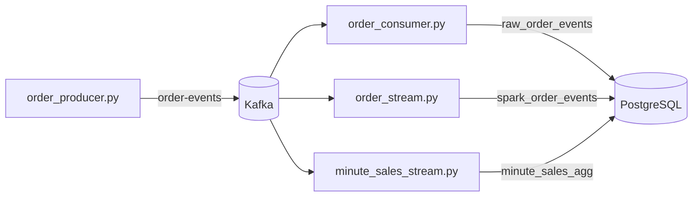

# DE Streaming Order Pipeline

Пайплайн потоковой обработки заказов: генерация событий → Kafka → запись в PostgreSQL (Python consumer и Spark Structured Streaming) → минутные агрегаты продаж.

## Архитектура



| Компонент | Назначение |
|-----------|------------|
| `producer/order_producer.py` | Генерирует синтетические события заказов и публикует в Kafka |
| `consumer/order_consumer.py` | Читает Kafka и пишет сырые события в `raw_order_events` |
| `spark/order_stream.py` | Spark Streaming: Kafka → `spark_order_events` |
| `spark/minute_sales_stream.py` | Spark Streaming: 1-минутные агрегаты оплаченных заказов → `minute_sales_agg` |

## Стек

- **Kafka** 4.1 (KRaft, без ZooKeeper)
- **PostgreSQL** 15
- **Apache Spark** 4.2 (Structured Streaming)
- **Python** 3 + kafka-python, psycopg2, faker

## Структура проекта

```
├── config/                  # Общие настройки (Kafka, DB, Spark)
│   ├── kafka.py
│   ├── database.py
│   └── spark.py
├── producer/                # Генератор событий
├── consumer/                # Python Kafka consumer → PostgreSQL
├── spark/                   # Spark Streaming jobs
├── sql/                     # DDL-скрипты
├── docker-compose.yml
├── requirements.txt
└── .env.example
```

Константы и параметры подключения вынесены в `config/`. Значения читаются из переменных окружения; локально — из `.env` (через `python-dotenv`), в Spark-контейнере — из `docker-compose.yml`.

## Быстрый старт

### 1. Инфраструктура

```bash
docker compose up -d
```

Поднимаются сервисы:

| Сервис | Порт на хосте |
|--------|---------------|
| Kafka | `9092` |
| PostgreSQL | `5435` |
| Spark | только внутри Docker-сети |

### 2. Python-окружение

```bash
python3 -m venv venv
source venv/bin/activate
pip install -r requirements.txt
cp .env.example .env
```

### 3. Схема БД

```bash
psql -h localhost -p 5435 -U streaming_user -d streaming_orders -f sql/create_tables.sql
psql -h localhost -p 5435 -U streaming_user -d streaming_orders -f sql/create_spark_tables.sql
psql -h localhost -p 5435 -U streaming_user -d streaming_orders -f sql/create_streaming_marts.sql
```

Пароль по умолчанию: `streaming_pass`

### 4. Запуск пайплайна

**Терминал 1 — producer:**

```bash
python producer/order_producer.py
```

**Терминал 2 — consumer (опционально):**

```bash
python consumer/order_consumer.py
```

**Терминал 3 — Spark: сырые события в PostgreSQL:**

```bash
docker compose exec spark \
  /opt/spark/bin/spark-submit \
  --conf spark.jars.ivy=/opt/spark-ivy \
  --packages org.apache.spark:spark-sql-kafka-0-10_2.13:4.2.0,org.postgresql:postgresql:42.7.7 \
  /opt/spark-apps/order_stream.py
```

**Терминал 4 — Spark: минутные агрегаты:**

```bash
docker compose exec spark \
  /opt/spark/bin/spark-submit \
  --conf spark.jars.ivy=/opt/spark-ivy \
  --packages org.apache.spark:spark-sql-kafka-0-10_2.13:4.2.0,org.postgresql:postgresql:42.7.7 \
  /opt/spark-apps/minute_sales_stream.py
```

## Таблицы PostgreSQL

| Таблица | Источник | Описание |
|---------|----------|----------|
| `raw_order_events` | Python consumer | Сырые события из Kafka |
| `spark_order_events` | `order_stream.py` | События, записанные Spark job |
| `minute_sales_agg` | `minute_sales_stream.py` | Агрегаты по 1-минутным окнам (`status = paid`) |

### Формат события в Kafka

```json
{
  "event_id": "uuid",
  "order_id": 12345,
  "customer_id": 67890,
  "product_id": 111,
  "quantity": 2,
  "unit_price": 99.99,
  "line_total": 199.98,
  "status": "paid",
  "city": "Berlin",
  "event_time": "2026-08-05T10:00:00+00:00"
}
```

## Конфигурация

Скопируй `.env.example` в `.env` и при необходимости измени значения.

| Переменная | По умолчанию (хост) | В Spark-контейнере |
|------------|---------------------|---------------------|
| `KAFKA_BOOTSTRAP_SERVERS` | `localhost:9092` | `kafka:29092` |
| `KAFKA_TOPIC` | `order-events` | `order-events` |
| `DB_HOST` / `DB_PORT` | `localhost` / `5435` | — |
| `JDBC_HOST` / `JDBC_PORT` | `postgres` / `5432` | задаётся в `docker-compose.yml` |
| `SPARK_CHECKPOINT_BASE` | `/opt/spark-checkpoints` | volume `./data/checkpoints` |

Consumer и producer используют `DB_*` (подключение с хоста). Spark jobs используют `JDBC_*` (подключение внутри Docker-сети).

## Spark jobs — детали

### `order_stream.py`

- Читает топик `order-events` с `startingOffsets=earliest`
- Парсит JSON, фильтрует невалидные записи
- Пишет батчами в `spark_order_events` каждые 5 секунд
- Checkpoint: `data/checkpoints/order-events-postgres/`

### `minute_sales_stream.py`

- Фильтрует только `status = paid`
- Watermark 2 минуты, окна по 1 минуте
- Метрики: `approx_count_distinct(order_id)`, `sum(quantity)`, `sum(line_total)`
- Upsert в `minute_sales_agg` (обновляет окно при повторной записи)
- Checkpoint: `data/checkpoints/minute-sales/`

> `approx_count_distinct` — ограничение Spark Structured Streaming: точный `countDistinct` на стриме не поддерживается.

## Проверка данных

```bash
# Сырые события (consumer)
psql -h localhost -p 5435 -U streaming_user -d streaming_orders \
  -c "SELECT count(*) FROM raw_order_events;"

# Spark raw sink
psql -h localhost -p 5435 -U streaming_user -d streaming_orders \
  -c "SELECT count(*) FROM spark_order_events;"

# Минутные агрегаты
psql -h localhost -p 5435 -U streaming_user -d streaming_orders \
  -c "SELECT * FROM minute_sales_agg ORDER BY window_start DESC LIMIT 10;"
```

## Troubleshooting

**Контейнер Spark не запускается**

```bash
docker compose logs spark
docker compose up -d --force-recreate spark
```

**`ModuleNotFoundError: dotenv` в Spark**

В контейнере `python-dotenv` не нужен — конфиг читает env напрямую. Убедись, что смонтированы `./config` и `./spark` (см. `docker-compose.yml`).

**`No suitable driver found for jdbc:postgresql://...`**

JAR PostgreSQL подключается через `--packages org.postgresql:postgresql:42.7.7`. В `minute_sales_stream.py` драйвер регистрируется через `DriverRegistry` перед upsert.

**Duplicate key на `minute_sales_agg`**

Стрим в режиме `update` пересчитывает окна — запись идёт через `INSERT ... ON CONFLICT DO UPDATE`, а не простой `append`.

**Сброс checkpoint после изменения логики**

```bash
rm -rf data/checkpoints/order-events-postgres data/checkpoints/minute-sales
```

## Остановка

```bash
# Ctrl+C в терминалах producer / consumer / spark-submit
docker compose down
```

Данные Kafka и PostgreSQL сохраняются в Docker volumes. Чтобы удалить и их:

```bash
docker compose down -v
```
